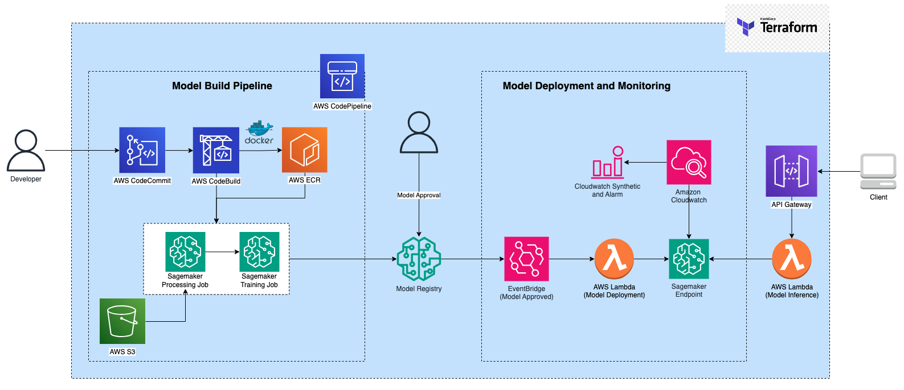

# AWS MLOps Pipeline
This MLOps pipeline leverages a suite of AWS services, including CodeCommit, CodeBuild, CodePipeline, Lambda functions, and SageMaker, to seamlessly integrate machine learning workflows into development and deployment processes.



# 1. Infra as Code(Iac) - Iac
The MLOps pipeline leverage Terraform as the Infrastructure as Code (IaC) tool for automation, transparency, reproducibility and mitigation of documentatios gaps. As the infrastructure needs evolve, Terraform allows seamless updates and modifications with minimal effort. It ensures the MLOps pipeline remains agile and adaptable to changing project demands. To effortlessly spin up the required infrastructure, follow these steps:
```
cd ~/ml_infra/manifest/
terraform init
terraform apply -auto-approve
```

# 2. GitOps with CodeCommit
This pipeline embraces a GitOps approach for effective software lifecycle management. Any code update triggers CodeBuild, orchestrating essential processes such as containerization, job submission, and Docker image push.

To seamlessly connect to AWS CodeCommit, configure your Git settings:
```
git config --global credential.helper '!aws codecommit credential-helper $@'
git config --global credential.UseHttpPath true
```

Initialize your repository using the `codecommit` url created in Step 1 by Terraform.
```
cd ~/ml_infra/
git init
git remote add origin https://git-codecommit.{region}.amazonaws.com/v1/repos/{repo-name}
```

Once initialized, proceed with the standard Git workflow:
```
git add . 
git commit -m 'init commit' 
git push -u origin master
```

# 3. CodePipeline for Training Job
Any update pushed to the AWS `CodeCommit` repository initiates an automated build process orchestrated by AWS `CodeBuild`. The build configuration is specified in the `buildspec.yml` file within the subfolder `./train/`.

The build process encompasses creating a Docker image, and pushing the docker image to Amazon `Elastic Container Registry`, providing a centralized repository for managing and versioning container images. As part of the build, the process triggers a training job in `SageMaker`, allowing the models to evolve seamlessly with each code update. The build can be found in `./train/buildspec.yml`.

While the build is automated, there is flexibility to trigger it manually using the command:
```
aws codebuild start-build --project-name <project-name>
```

You can retrieve the latest `build ID` for your project and use the obtained build ID to query log events in `CloudWatch` to monitor the processes
```
aws codebuild list-builds-for-project --project-name <project-name>

aws logs get-log-events --log-group-name <project-name> --log-stream-name <build-id> --limit 10 --output text --query 'events[*].message'
```

# 4. Trigger sagemaker training job
The SageMaker training job is seamlessly automated by `CodePipeline` when there's a code update. However, for enhanced flexibility, you can trigger it at any time, especially when new data or configurations are available. 

For manual trigger, use the provided script `train/run_job.py` to start a SageMaker training job. When running this script, it initiates a training job on the `SageMaker` platform, leveraging the cloud compute power from the platform.
```
python assets/run_job.py \
--file_location <training-data-csv> \
--model_package_group_name <model-package-group-name>
--instance_type <instance_type>
```

Once the job is submitted, you can check the training progress using `describe-training-job`
```
aws sagemaker list-training-jobs --status-equals InProgress
aws sagemaker describe-training-job --training-job-name <training-job-name>
```

# 5. Model Registry and Approval
After the model is trained, the artifact is uploaded to the Model Registry. However, an additional manual approval step is required to ensure human verification before the model is qualified for the next phase.

Use the following command to list all models under the specified model package group and check their approval status:
```
aws sagemaker list-model-packages --model-package-group-name <model-package-group-name>
```

Utilize the provided Python script train/approve.py to approve a specific model in the registry. This manual approval process ensures an extra layer of verification before deploying models into production, promoting accountability and accuracy in the model deployment pipeline. This script signs and approves the model, indicating that it has passed the necessary human review:
```
python train/approve.py --model_package_arn <model-package-arn>
```
Once this approval step is successfully completed, the model is now ready to be deployed to your desired endpoint!

# 6. Model Deployment
In our actual pipeline, once a model is approved in the Model Registry, the deployment process is seamlessly orchestrated. The new model is deployed instantly through EventBridge, utilizing a Blue-Green Linear approach to replace the old endpoint.

For added flexibility, you can manually deploy a specific model using the provided script deploy/main.py. Define the model package ARN to be deployed as follows:
```
python deploy/main.py --model_package_arn <package-arn>
```

Once the deployment is complete, check the status of the endpoint using the following command:
```
aws sagemaker describe-endpoint --endpoint-name <endpoint-name>
```
This deployment strategy ensures a seamless transition to updated models, both automatically and manually, catering to your deployment preferences and requirements.


# 7. Model Inference API
In the final step of our pipeline, we provide a Model Inference API that allows you to infer with the deployed model from anywhere. This API is powered by a Lambda function and API Gateway, streamlining the process of obtaining responses from the SageMaker endpoint.

The Lambda function handles the heavy lifting, including data processing and storage. It acts as a bridge between external requests and the SageMaker endpoint, ensuring a seamless and efficient inference process.

The API is designed to be triggered with REST protocols from anywhere. Here's a sample code snippet in Python that demonstrates how to make a POST request to the API:
```python
import pandas as pd
import requests
import json

url = 'https://{gateway-id}.execute-api.{region}.amazonaws.com/{stage-name}/{api-name}'
payload = {"context": b"5.1, 3.5, 1.4, 0.2"}
response = json.loads(requests.post(url, json=payload).json()['body'])
print(response)
```

## About
- **Author:** CheeKean
- **Email:** zekinchan@gmail.com
- **Created:** 14th Nov 2023
- **Last Updated:** 14th Nov 2023